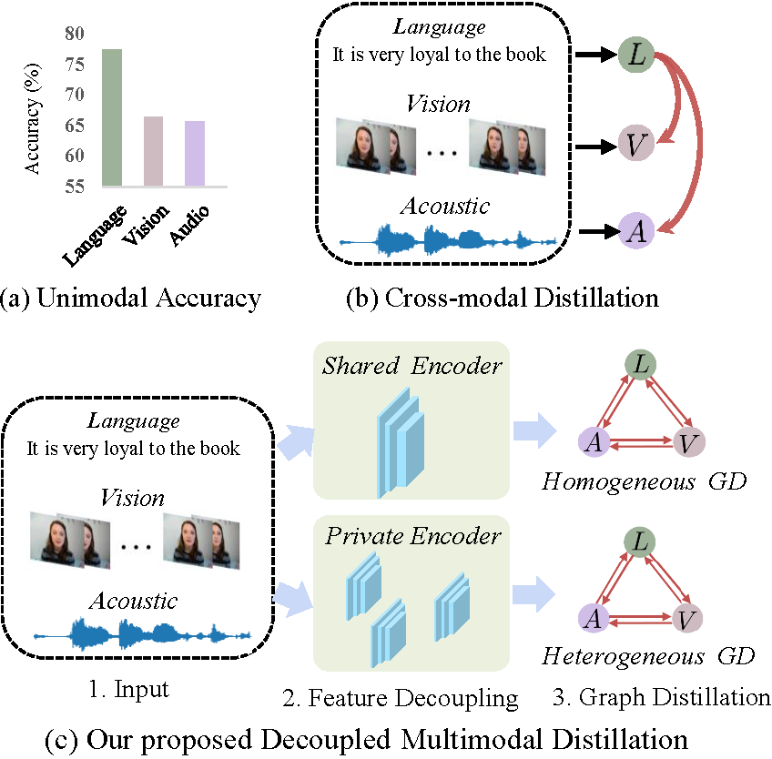
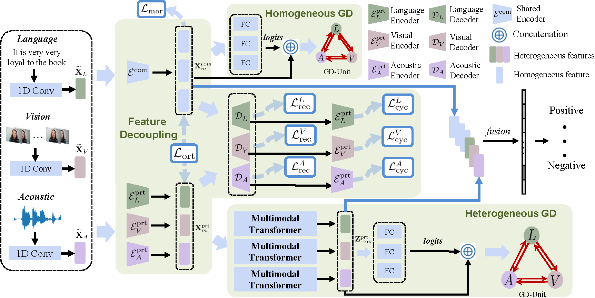
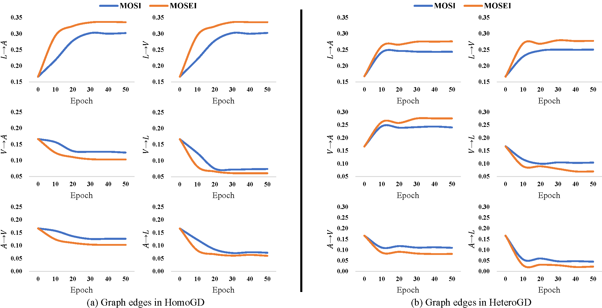

# Decoupled Multimodal Distilling for Emotion Recognition, CVPR 2023

We propose a decoupled multimodal distillation (DMD) approach that facilitates flexible and adaptive crossmodal knowledge distillation. The key ingredients includes:
- The representation of each modality is decoupled into two parts, i.e., modality-irrelevant/-exclusive spaces. 
- We utilizes a graph distillation unit (GD-Unit) for each decoupled part so that each knowledge distillation can be performed in a specialized and effective manner.
- A GD-Unit consists of a dynamic graph where each vertice represents a modality and each edge indicates a dynamic knowledge distillation. 

In general,  the proposed GD paradigm provides a flexible knowledge transfer manner where the distillation weights can be automatically learned, thus enabling diverse crossmodal knowledge transfer patterns.

## The motivation.

</img>

Motivation and main idea: (a) illustrates the significant emotion recognition discrepancies using unimodality, adapted from [Mult](https://github.com/yaohungt/Multimodal-Transformer). (b) shows the conventional cross-modal distillation. (c) shows our proposed DMD.

## The Framework.

The framework of DMD.

## The learned graph edges.

Illustration of the graph edges in HomoGD and HeteroGD. In (a), $L \to A$ and $L \to V$ are dominated because the homogeneous language features contribute most and the other modalities perform poorly. In (b), $L \to A$, $L \to V$, and $V \to A$ are dominated.  $V \to A$ emerges because the visual modality enhanced its feature discriminability via the multimodal transformer mechanism in HeteroGD.

